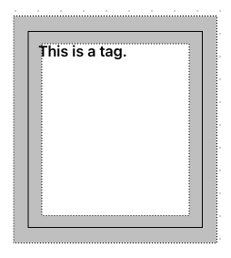

# Canvas Gallary

## What is it?
This is a vanilla JS website that will allow users to upload images and annotate them.
### Run it
1. Install `http-server`
```
npm install -g http-server
```
2. Run
```
http-server .
```
3. Open http://localhost:8080/ to see the result

## Features
### 1. Image Upload
Clicking "Upload New Images" will prompt file selection. The selected images will be pushed to the front of the image list and saved in browser's Local Storage. The images are initiated on load or refresh of the page.
The current image on the page will be refreshed to the newly uploaded image.

### 2. Annotate Image (a.k.a Tag)
On the screen area of the current image displayed on the page, the user can select any area and provide a text which will be displayed on the top left corner of the area. The text will be added to a list below the image and the user can delete any tag by clicking the "Delete" button at the end of the list item. Multiple tags can be created, and they can be overlapped. Click "Clear All Tags" to delete all tags.
The tags are saved in browser's Local Storage to be initiated on load or refresh of the page.

### 3. Draggable Tags
The user is able to drag any existing tag to a new position. And the new position will be remembered in Local Storage as well.

### 4. Switch Images
The user is able to click "Back" to display previous image and its associated tags, or "Next" to the next.

## Technical Design
### 1. Mouse Interaction
When `mouseDown` event is triggered within the boundary of the image, the coordinates will be calculated to see if this is for dragging an existing tag or creating a new tag.

To illustrate, when clicking on the border of the tag or near the border as shown below in the grey area, the event will be flagged as a "dragging" event. And the user will be repositioning the tag. Otherwise, it will be treated as a tag creation event.


### 2. Local Storage
Local Storage is used to store all images and tags.
Images names are saved to a list, and they are also keys to retrieve their own image datas which are saved as individual items in Local Storage.
Tag keys are prefixed with its image name to allow different images to have the same tag text. Tag values have the positioning information as well to correctly load the tags when the page loads or refreshes.

### 3. Responsiveness
When window size changes, the image area will be adjusted to the `window.innerWidth` and `window.innerHeight`

## Limitations / TODO List
- [ ] Responsiveness for tags to adjust according to screen size
- [ ] Display warning messages to users when tag area is not big enough to contain the tag text.
- [ ] Unit tests
- [ ] Add warnings for images/tags with same name, this is not accommodated for now
- [ ] Create unique id for each image and each tag. 
> Currently image names are used as the key to each image data stored in Local Storage, same with tag texts. In order not to use other libraries and `Math.random` is [not cryptographically secure](https://stackoverflow.com/a/5651854), and the [Web Crypto API](https://developer.mozilla.org/en-US/docs/Web/API/Crypto/getRandomValues) seems costly. This is left for future implementation.
- [ ] Allow uploading multiple images at once.
> Only one file can be selected when clicking "Upload New Images", this could be further developed to allow the user to upload many files at once.
- [ ] Make the cursor as "move" when nearing the border of a tag.
> Now is only on the border, and a `OFFSET` 10 is hardcoded to allow "error" for selecting the borders. Maybe this can be further enhanced in terms of UX design.


